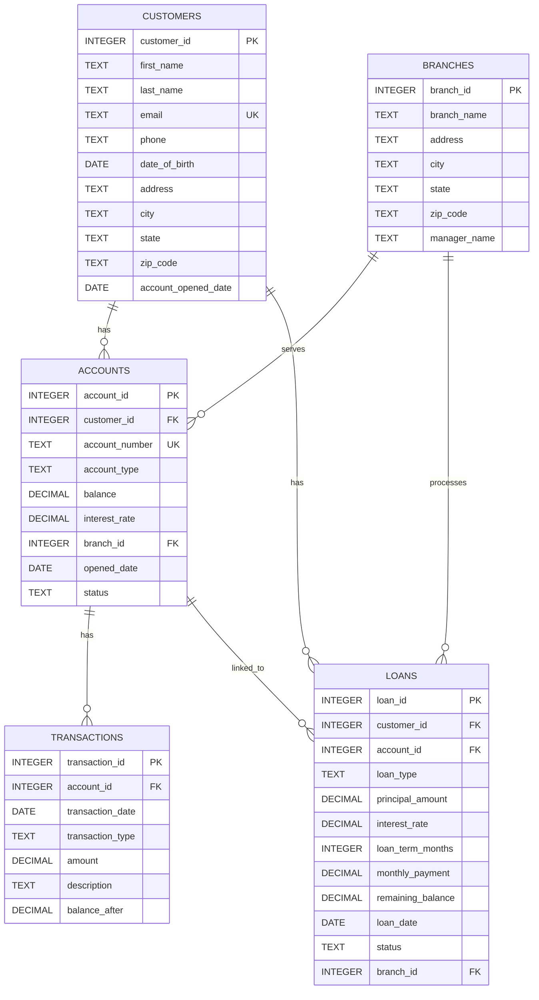

# Entity Relationship Diagram (ERD) - Banking Database

## Visual ERD (Mermaid Diagram)

## Relationship Details

### 1. CUSTOMERS → ACCOUNTS
- **Relationship Type**: One-to-Many (1:N)
- **Cardinality**: One customer can have many accounts
- **Foreign Key**: `accounts.customer_id` → `customers.customer_id`
- **Description**: A customer can open multiple accounts (checking, savings, etc.)

### 2. CUSTOMERS → LOANS
- **Relationship Type**: One-to-Many (1:N)
- **Cardinality**: One customer can have many loans
- **Foreign Key**: `loans.customer_id` → `customers.customer_id`
- **Description**: A customer can have multiple loans (mortgage, auto, personal, etc.)

### 3. BRANCHES → ACCOUNTS
- **Relationship Type**: One-to-Many (1:N)
- **Cardinality**: One branch can serve many accounts
- **Foreign Key**: `accounts.branch_id` → `branches.branch_id`
- **Description**: Accounts are opened at specific branches

### 4. BRANCHES → LOANS
- **Relationship Type**: One-to-Many (1:N)
- **Cardinality**: One branch can process many loans
- **Foreign Key**: `loans.branch_id` → `branches.branch_id`
- **Description**: Loans are processed at specific branches

### 5. ACCOUNTS → TRANSACTIONS
- **Relationship Type**: One-to-Many (1:N)
- **Cardinality**: One account can have many transactions
- **Foreign Key**: `transactions.account_id` → `accounts.account_id`
- **Description**: Each transaction is associated with an account

### 6. ACCOUNTS → LOANS
- **Relationship Type**: One-to-Many (1:N)
- **Cardinality**: One account can be linked to multiple loans (optional)
- **Foreign Key**: `loans.account_id` → `accounts.account_id` (nullable)
- **Description**: Loans can optionally be linked to a specific account

## Table Descriptions

### CUSTOMERS
Stores customer personal information and demographics.
- **Primary Key**: `customer_id`
- **Unique Constraint**: `email`
- **Key Fields**: Customer identification, contact info, address, account opening date

### BRANCHES
Stores bank branch location and management information.
- **Primary Key**: `branch_id`
- **Key Fields**: Branch name, address, manager name

### ACCOUNTS
Stores bank account information (checking, savings, etc.).
- **Primary Key**: `account_id`
- **Unique Constraint**: `account_number`
- **Foreign Keys**: 
  - `customer_id` → `customers.customer_id`
  - `branch_id` → `branches.branch_id`
- **Key Fields**: Account number, type, balance, interest rate, status

### TRANSACTIONS
Stores all financial transactions (deposits, withdrawals).
- **Primary Key**: `transaction_id`
- **Foreign Key**: `account_id` → `accounts.account_id`
- **Key Fields**: Transaction date, type, amount, description, balance after transaction

### LOANS
Stores loan information (mortgage, auto, personal, etc.).
- **Primary Key**: `loan_id`
- **Foreign Keys**: 
  - `customer_id` → `customers.customer_id`
  - `account_id` → `accounts.account_id` (nullable)
  - `branch_id` → `branches.branch_id`
- **Key Fields**: Loan type, principal, interest rate, monthly payment, remaining balance, status

## Data Flow Summary

1. **Customer Onboarding**: Customer opens account at a branch → creates record in `customers` and `accounts`
2. **Account Activity**: Transactions are recorded in `transactions` table linked to `accounts`
3. **Loan Processing**: Customer applies for loan at branch → creates record in `loans` linked to `customers` and optionally `accounts`
4. **Reporting**: Queries can join across tables to analyze customer relationships, account activity, loan portfolios, and branch performance

## Common Query Patterns

- **Customer Account Summary**: `CUSTOMERS` JOIN `ACCOUNTS` JOIN `BRANCHES`
- **Transaction History**: `ACCOUNTS` JOIN `TRANSACTIONS`
- **Loan Portfolio**: `CUSTOMERS` JOIN `LOANS` JOIN `BRANCHES`
- **Branch Performance**: `BRANCHES` JOIN `ACCOUNTS` JOIN `TRANSACTIONS`
- **Customer Financial Overview**: `CUSTOMERS` JOIN `ACCOUNTS` JOIN `LOANS`

